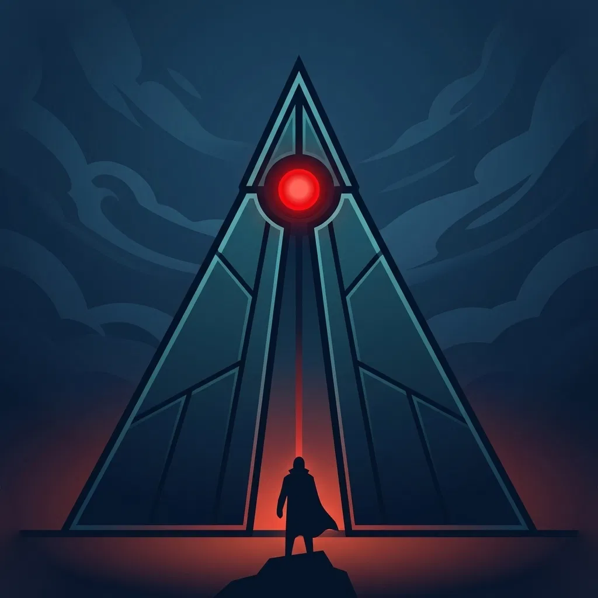

# Nightland — Gameplay &amp; Story Design

**Purpose:** narrative, pacing, and content design decisions — separate from technical build status (see `GAMEBOARD_SYSTEM_CHECKLIST.md` for that). This doc is about _what the game is and does_, not _what's been coded_.

**Structural note: House of Silence is a convergence point for SEVERAL storylines, not just one.** Everything below the Act One Pacing Plan — Tesseract, Persius, the Salamander, Current-Loom, Deep Silo, the Silent Ones — is **one storyline** (the Earth-Current thread) that happens to resolve at House of Silence. Other, separate storylines are expected to be designed later, each converging on the same location without necessarily touching this one. Don't assume this thread is the whole ending — it's a load-bearing piece of it, not the sum of it.

---

## Storyline 1: The Earth-Current Thread (Tesseract → Persius → Salamander → Current-Loom → Deep Silo → Silent Ones)

## Act One Pacing Plan (first third of the game)

A real, ordered sequence — not a scattered list of ideas.

1. **Tesseract note** (`word-tile-crypt-01`) — EXISTS. Practice puzzle, guaranteed first encounter.
2. **Hermit Hollow** — EXISTS, grants Hide. **Content update needed:** dialogue should introduce the Salamander concept (check whether current dialogue already does anything like this).
3. **Salamander puzzle** (`word-tile-crypt-02`) — EXISTS. Narratively intended to come after Hermit Hollow (soft pacing only — confirmed NOT a mechanical gate). **Content update needed:** the Salamander's Letter reward text needs rewriting to reveal he INVENTED Discos, and that his machine (the Current-Loom) is how it can be overpowered. Current shipped text doesn't say either of these yet.
4. **Aero-Wreckage** — EXISTS, tentative placement here ("maybe").
5. **First Current-Loom encounter.**
6. **Current-Loom reveal note** (rune-locked) — tells of the Looms.
7. **Place a couple of Current-Looms on branch trails**, not just the main trunk.
8. **Jaunt Cave** — EXISTS, grants Jaunt.
9. **Deep Silo, hard-locked** — per the Current-Loom → Deep Silo gate design below.
10. **Deep Silo/Current-Loom/Discos reveal note** (rune-locked) — explains the gate AND the Silent Ones motivation.
11. **The Rune Obelisk.** **UX change needed:** do NOT explicitly tell the player anything got translated — no "you can now read runes!" messaging anywhere. The reveal should be discovered organically (player revisits an old note and simply notices it's readable now). Audit current obelisk completion flow for anything that announces this and remove it.
12. **Current-Loom.**
13. **Jaunt Cave** (second instance, already exists).
14. **Current-Loom.**

**Confirms/uses:** exactly 5 Current-Loom instances total (steps 5, 7×2, 12, 14) and exactly 2 Jaunt Cave instances (steps 8, 13) — 2 Jaunt Cave already exist, no more needed. **3 more Current-Loom instances** need authoring beyond the existing 2.

**Real to-dos this sequence surfaces (content updates to already-shipped material, not brand-new content):**

- [ ] Check/update Hermit Hollow's dialogue to introduce the Salamander
- [ ] Rewrite the Salamander's Letter to reveal Discos's true origin and the Current-Loom connection
- [ ] Audit the rune obelisk's completion flow for any explicit "translation unlocked" messaging and remove it

**Open difficulty question — not yet resolved:** the player has zero defensive tools (no Hide, no Jaunt) for the entire stretch before Hermit Hollow. Given the established design philosophy (long, dangerous trail; "I want the player to die a lot"), a brutal unarmed opening may be intentional — dying repeatedly before earning Hide could make that unlock feel like a real turning point rather than just another item. Alternatively, this stretch or Hermit Hollow's placement may need softening so it doesn't feel unfair before the player has any tools at all. **Needs a real decision, not an assumption either way.**

&nbsp;

---

## Word-Grid Content Roster

1. `word-tile-crypt-01` (Tesseract) — EXISTS. Practice puzzle, guaranteed first.
2. `word-tile-crypt-02` (Salamander) — EXISTS. Tells of the Salamander (needs rewrite, see above).
3. _New, needed_ — tells of Deep Silo. Does double duty: reveals (with #4, via rune-lock) the Current-Loom → Deep Silo gate, AND explains the real motivation — powering up Discos to fight the Silent Ones.
4. _New, needed_ — tells of the Current Looms. The other half of the gate reveal alongside #3.
5. _New, needed_ — placed late in the game. Rewards the minimap ability.

---

## Current-Loom

**Count:** fixed at 5 total instances (not open-ended/scaling) — simplifies the Deep Silo "look closer" status screen to always exactly 5 lights.

**What they are:** ancient Earth-Current regulator stations — part of the SAME infrastructure network Deep Silo's own generator belongs to, not a separate system.

**Three-tier payoff for restoring them:**

1. **Local/immediate:** ties into monster spawn zones (see `GAMEBOARD_SYSTEM_CHECKLIST.md`'s deferred technical item) — a restored Loom could calm Current instability nearby, reducing spawn rates in that region.
2. **Mid-game mechanical:** Discos's second planned upgrade should require or scale with how many Current-Looms have been restored — the real reason the puzzle matters, not just a reward for completing it.
3. **Endgame narrative:** the Salamander needs "a place where the Earth Current is strong enough to harness" to complete his work with the Tesseract — restoring Current-Looms is literally that groundwork, and could gate a real ending variant at House of Silence.

**Placement:** at least two of the five should sit on branch trails specifically, not just the main trunk.

---

## Current-Loom → Deep Silo Hard Gate

Deep Silo's entrance is a hard lock — cannot be entered at all — until the player has completed all 5 Current-Loom instances.

**Narrative delivery:** the two new word-grid notes (roster #3, #4) explain this, using the already-built rune-lock mechanic (`lockedUntilFlag: 'runeCipherLearned'`) — unreadable until the Rune Obelisk is solved.

**"Look closer" status screen while locked:** a simple, non-puzzle status panel — exactly 5 lights, lit if that Current-Loom is completed / unlit if not. Suggested label: "Current Looms Online."

**Real architectural note (for whoever builds this, see technical checklist too):** the existing `active`/`initialActive` boolean on board entrance objects may be the right hook for the lock itself.

---

## The Silent Ones

New enemy type, guardians of/within House of Silence. **Indestructible against any normal weapon** — engaging one without the Deep-Silo-upgraded Discos is an automatic death, no real fight possible. Only the powered-up Discos can damage them at all.

This is the concrete, high-stakes reason the whole Current-Loom → Deep Silo → Discos-upgrade chain matters — not just ancient-lore flavor. Explained to the player via the Deep Silo word-grid note (roster #3).

---

## House of Silence — Ending Rewards

Two distinct rewards, deliberately split:

- **Minimap** — comes from a dedicated late-game word-grid instance (roster #5), NOT from House of Silence itself.
- **"Jaunt Anywhere"** — an evolved, ultimate version of the Jaunt ability (presumably no crystal-charge limits at all) — the actual victory reward for winning House of Silence itself. The true endgame power.

---

## Other repeatable-shape / content roadmap items (not yet designed in detail)

- A second new repeatable game shape beyond word-grid, timed-encounter, and Current-Loom (roadmap item, no concept locked in yet)
- Two more one-off encounters beyond what exists today (no concepts locked in yet)
- Whispering Roads — a crossroads encounter where the player must choose between roads that "whisper" different directions; mostly evil, one is not. Mechanic not yet designed (discussed briefly, parked before Current-Loom work took over the session).

---

## Other Convergence Storylines (not yet designed)

House of Silence needs more than one thread feeding into it. Storyline 1 above
covers the Earth-Current/Discos/Silent-Ones arc — real, resolved narrative
design, ready to build toward. Additional, independent storylines are expected
here as they get designed, each converging on House of Silence in their own
way. None yet started.

---

_This doc is for story/gameplay/pacing decisions. For technical build status (what's coded, what's tested, what's deferred), see `GAMEBOARD_SYSTEM_CHECKLIST.md`._
